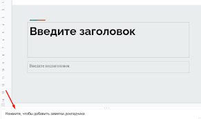
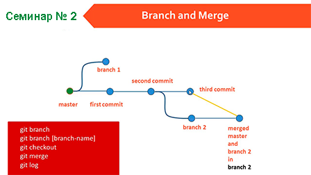

# **Основные команды первого семинара**

 

#### Первое действие при создании папки, действия в которой мы хотим отслеживать - инициализация этой папки. Выполняется командой:

- _**git init**_ - Инициализация локального репозитория.

#### Когда мы хотим посмотреть, что в данный момент происходит с отслеживаемыми файлами - выполняем команду:

- _**git status**_ - Получить информацию от гит о его текущем состоянии.

#### В случае, если после выполнения команды _git status_ мы видим сообщение терминала - 
  _Changes not staged for commit:
  (use "git add <file>..." to update what will be committed)
  (use "git restore <file>..." to discard changes in working directory)_

_modified:   information.md_

_no changes added to commit (use "git add" and/or "git commit -a")_ - выполняем последовательно комманды:

- _**git add**_ - Добавляем файл в отслеживание к следующему коммиту. После введения команды _git add_ в терминале через пробел пишем первые три знака файла, добавляемого в отслеживание, и жмём Tab (полное название файла с правильным расширением и синтаксисом понятным ГИТу подставится автоматически).
- _**git commit**_ - Добавляем коммит к новому сохранению файла. При выполнении комманды _git commit_ через пробел добавляем _**-m**_ (что означает -message) и через ещё один пробел в кавычках пишем ёмкое определение в котором мы хотим передать суть изменения файла на данный момент _"Added command usage git add and git commit"_.

* _**git log**_ – Вывод на экран истории всех коммитов с их хеш-кодами, перемещаться между ними можно при помощи следующей комманды.

* _**git checkout**_ – Переход от одного коммита к другому, так же используется для перехода между ветками редактируемого файла.

* _**git checkout master**_ – Вернуться к актуальному состоянию и продолжить работу.

* _**git diff**_ – Позволяет увидеть различия между текущим и закоммиченным файлом.

# **Синтаксис языка Markdown**

## _**Заголовок**_

Для выделения заголовков используется символ "#". Количество символов "#" задаёт уровень заголовка, всего поддерживается 6 уровней:

1. # _Заголовок_
2. ## _Заголовок_
3. ### _Заголовок_
4. #### _Заголовок_
5. ##### _Заголовок_
6. ###### _Заголовок_

Символами (_**=**_) или  (_**-**_) не менее 3-ёх подряд также выделяют заголовки:

 - (_**=**_) - первого

   1. === Заголовок ====

 - (_**-**_) - второго уровней:

   2. --- Заголовок ---  

## _**Полужирный**_

Чтобы выделить текст полужирным достаточно либо обрамить его двумя звёздочками (**) вначале и в конце:

- **Полужирное начертание** 

либо двумя знаками подчеркивания (__):

 - __Полужирное начертание__

## _**Курсив**_

 Чтобы выделить текст курсивом достаточно либо обрамить его знаком нижнего подчёркивания (_) вначале и в конце:

 - _Пишем курсивом_

 либо звёздочкой (*):

 - *Пишем курсивом*

## _**Полужирное курсивное начертание**_

Полужирное курсивное начертание выделяется также двумя способами - либо тремя звёздочками (***) вначале и в конце текста:

  - ***пишем полужирным курсивом***

либо одним знаком подчёркивания и двумя звёздочками ( _** ) вначале текста и зеркальным отображением этого сочетания в конце ( **_ )

  - _**пишем полужирным курсивом**_

## _**Зачёркнутый текст**_

Зачёркнутый текст выделяется двумя знаками тильда (~~) перед и после текста который мы хотим видеть зачёркнутым.

  - ~~Пишем зачёркнутым текстом~~

## _**Списки**_

Списки в языке Markdown можно сделать нумерованными либо ненумерованными - выделенные буллитами, в первом варианте мы указываем нумерацию цифрами, после которых ставим точку (1.):

  1. Первый элемент списка.
  2. Второй элемент списка.
  3. Третий элемент списка.

  во втором варианте (ненумерованный) список выделяется дефисом (-):

  - Первый элемент списка.
  - Второй элемент списка.
  - Третий элемент списка. 

> ## _**Работа с изображениями**_

Вставка изображений в языке Markdown может быть выполнена коммандой из сочетания восклицательного знака - ! затем, квадратные скобки [описание изображения/название] и затем в круглых скобках (имя файла с расширением, который мы хотим вставить в текст) При этом файл должен находиться в папке с репозиторием нашего файла.

# **Основные комманды второго семинара**

_**git commit -am “message”**_ – добавление файлов в отслеживание и создание коммита одной коммандой.

_**git branch**_ – посмотреть список веток в репозитории

_**git branch <название ветки>**_ – создать новую ветку.

_**git branch -d <название ветки>**_ – удалить ветку.

_**git checkout <название ветки>**_ – переход к другой ветке.

_**git checkout -b <название ветки>**_ - создать ветку и перейти на неё.

_**git merge <название ветки>**_ - слияние ветки в которой мы выполняем комманду _**merge**_ с веткой _**<название ветки>**_

_**git merge --abort**_ - отменить слияние, которое прошло с конфликтом.

_**git log**_ – вывод на экран истории всех коммитов с их хеш-кодами.

_**git log --graph**_ - вывод на экран истории всех коммитов с их хеш-кодами в древовидной форме.
